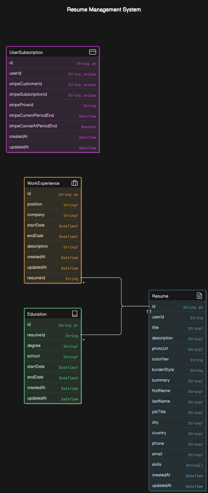

# RESYNOX

## Documentation for SmartResume Deployment Resources
This document outlines the resources created and deployed using the AWS CDK for the SmartResume project. It details the components deployed, their configurations, and their roles in the system architecture.

### 1. Overview of the Deployment
The deployment was executed using the AWS Cloud Development Kit (CDK) to automate the provisioning of infrastructure for the SmartResume application. The stack is named SmartResumeDbStack, and it primarily focuses on the backend infrastructure, including a database and its supporting network setup.

### 2. Key Resources Created
#### 2.1 Amazon Virtual Private Cloud (VPC)
Resource Name: VpcConstruct/AIResumeVPC
Purpose: Provides isolated network resources for the application.
Configuration:
Subnets:
Public Subnet 1 and 2
Private Subnet 1 and 2
Internet Gateway: Enables internet connectivity for public subnets.
NAT Gateways: Allow private subnet resources to access the internet securely.
#### 2.2 Subnets
Public Subnets:
Subnet 1: VpcConstruct/AIResumeVPC/PublicSubnet1/Subnet
Subnet 2: VpcConstruct/AIResumeVPC/PublicSubnet2/Subnet
Elastic IPs are associated for NAT Gateways.
Private Subnets:
Subnet 1: VpcConstruct/AIResumeVPC/PrivateSubnet1/Subnet
Subnet 2: VpcConstruct/AIResumeVPC/PrivateSubnet2/Subnet
#### 2.3 Amazon RDS (PostgreSQL Database)
Resource Name: DatabaseConstruct/AIResumeDB
Purpose: Provides a managed relational database service for the application.
Configuration:
DB Instance Identifier: DatabaseConstructAIResumeDB
Subnet Group: Database instances are deployed in the private subnets.
Security Group: Restricts access to the database, allowing connections only from authorized resources.
Credentials Management: Stored securely in AWS Secrets Manager.
#### 2.4 AWS Secrets Manager
Secret Name: resynox-dev-db-credentials
Purpose: Manages and rotates the database credentials securely.
Attachment: Links the credentials to the RDS instance for seamless integration.
#### 2.5 IAM Roles
Roles Created:
Lambda Execution Role: Custom::VpcRestrictDefaultSGCustomResourceProvider/Role
Policies Attached:
AWSLambdaBasicExecutionRole: Grants the Lambda function permissions to write logs to CloudWatch.
#### 2.6 Networking Components
Route Tables:
Configured for public and private subnets to route traffic appropriately.
NAT Gateways:
Public Subnet 1: VpcConstruct/AIResumeVPC/PublicSubnet1/NATGateway
Public Subnet 2: VpcConstruct/AIResumeVPC/PublicSubnet2/NATGateway
Security Groups:
Database Security Group: Restricts ingress and egress rules for the database.
#### 2.7 Amazon Route 53
Resource Name: RdsCnameRecord
Purpose: Creates a DNS record to provide a user-friendly hostname for the database endpoint.
#### 2.8 AWS Lambda
Resource Name: Custom::VpcRestrictDefaultSGCustomResourceProvider/Handler
Purpose: Custom resource handler to manage security group rules.
### 3. Deployment Process
CDK Synthesis: Generates the CloudFormation template.

Stack Name: SmartResumeDbStack
Resources Deployed: 34 total.
Deployment Time: 476.23 seconds.

#### 4. Security Considerations
IAM Policies: Least privilege policies were applied to IAM roles.
Security Groups: Database security group restricts ingress to specific trusted sources.
Secrets Management: AWS Secrets Manager securely stores and rotates sensitive credentials.

#### 5. Observations and Recommendations
Deployment Logs: Ensure to monitor logs for eventual consistency and resource creation states.
Scalability: Subnets and NAT Gateways provide flexibility for scaling additional resources in the future.
Cost Monitoring: Monitor costs for NAT Gateways, RDS instances, and other resources.
Automation: Leverage AWS CDK pipelines for continuous integration and deployment.

## DAtabase Schema

